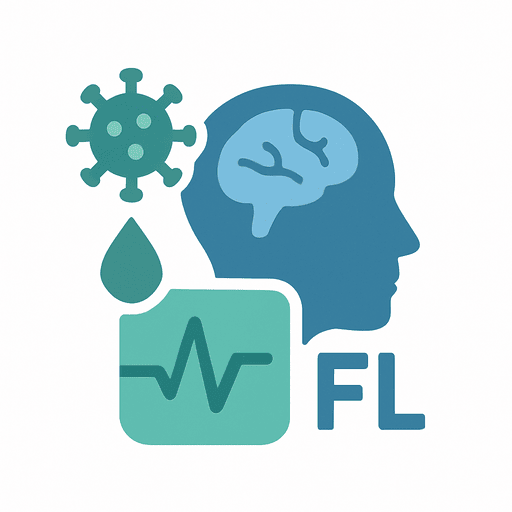

<a id="febrilogic"></a>

[![BuyMeACoffee][buymeacoffee-shield]][buymeacoffee-url]
[![LinkedIn][linkedin-shield]][linkedin-url]
[![Peerlist][peerlist-shield]][peerlist-url]

<!-- PROJECT LOGO -->
<br />
<div align="center">
  <a href="https://github.com/muhammadazzazy/febrilogic">
    
  </a>

  <h3 align="center">FebriLogic</h3>

  <p align="center">
    Guiding clinicians through the fever puzzle
    <br />
    <a href="https://github.com/muhammadazzazy/febrilogic"><strong>Explore the docs »</strong></a>
    <br />
    <br />
    <a href="https://github.com/muhammadazzazy/febrilogic">View Demo</a>
    &middot;
    <a href="https://github.com/muhammadazzazy/febrilogic/issues/new?labels=bug&template=bug-report---.md">Report Bug</a>
    &middot;
    <a href="https://github.com/muhammadazzazy/febrilogic/issues/new?labels=enhancement&template=feature-request---.md">Request Feature</a>
  </p>
</div>

<!-- TABLE OF CONTENTS -->
<details>
  <summary>Table of Contents</summary>
  <ol>
    <li>
      <a href="#about-the-project">About The Project</a>
      <ul>
        <li><a href="#entity-relationship-diagram-erd">Entity-Relationship Diagram (ERD)</a></li>
        <li><a href="#built-with">Built With</a></li>
        <li><a href="#deployment">Deployment</a></li>
      </ul>
    </li>
    <li>
      <a href="#getting-started">Getting Started</a>
      <ul>
        <li><a href="#prerequisites">Prerequisites</a></li>
        <li><a href="#installation">Installation</a></li>
        <ul>
            <li><a href="#running-the-fastapi-backend">Running the FastAPI Backend</a></li>
            <li><a href="#running-the-streamlit-frontend">Running the Streamlit Frontend</a></li>
        </ul>
      </ul>
    </li>
    <li>
      <a href="#roadmap">Roadmap</a>
      <ul>
        <li><a href="#fastapi-backend">FastAPI Backend</a></li>
        <li><a href="#streamlit-frontend">Streamlit Frontend</a></li>
      </ul>
    </li>
    <li><a href="#contributing">Contributing</a></li>
    <li><a href="#license">License</a></li>
    <li><a href="#contact">Contact</a></li>
    <li><a href="#acknowledgments">Acknowledgments</a></li>
  </ol>
</details>

<!-- ABOUT THE PROJECT -->

## About The Project

[![FebriLogic][febrilogic-screenshot]](https://febrilogic.com)
FebriLogic is a clinical decision support tool that helps healthcare professionals quickly and accurately differentiate between acute febrile illnesses (AFIs). It leverages real-world data and a novel diagnostic algorithm to provide evidence-based insights at the point of care.

<p align="right">(<a href="#febrilogic">back to top</a>)</p>

### Entity-Relationship Diagram (ERD)

![ERD][erd]

<p align="right">(<a href="#febrilogic">back to top</a>)</p>

### Built With

- [![Python][Python]][Python-url]
- [![FastAPI][FastAPI]][FastAPI-url]
- [![SQLAlchemy][SQLAlchemy]][SQLAlchemy-url]
- [![PostgreSQL][PostgreSQL]][PostgreSQL-url]
- [![Pydantic][Pydantic]][Pydantic-url]
- [![Pandas][Pandas]][Pandas-url]
- [![NumPy][NumPy]][NumPy-url]
- [![Resend][Resend]][Resend-url]
- [![Streamlit][Streamlit]][Streamlit-url]

<p align="right">(<a href="#febrilogic">back to top</a>)</p>

### Deployment

- [![Render][Render]][Render-url]
- [![Streamlit Community Cloud][Streamlit-Community-Cloud]][Streamlit-Community-Cloud-url]

<p align="right">(<a href="#febrilogic">back to top</a>)</p>

<!-- GETTING STARTED -->

## Getting Started

This is an example of how you may give instructions on setting up your project locally.
To get a local copy up and running follow these simple example steps.

### Prerequisites

- [Python 3.12+](https://www.python.org/downloads)

  ```sh
  # Debian-based distros
  sudo apt-get install python3
  ```

- python3.12-venv for Debian-based distros

  ```sh
  # Debian-based distros
  sudo apt-get install python3.12-venv
  ```

### Installation

1. Get free API keys at

   - [Resend](https://resend.com)
   - [Groq](https://groq.com)
   - [OpenRouter](https://openrouter.ai)

2. Clone the repo

   ```sh
   git clone https://github.com/muhammadazzazy/febrilogic.git
   ```

3. Navigate into the project directory

   ```sh
   cd febrilogic
   ```

#### Running the FastAPI Backend

4. Navigate into [app/apis](app/apis)
   ```sh
   cd app/apis
   ```
5. Create a .env file

   ```.env
   # Required file path for the symptom and disease data.
   SYMPTOM_WEIGHTS_FILE=""

   # Required file path for disease biomarker statistics.
   BIOMARKER_STATS_FILE=""

   # Optional. Defaults to HS256.
   ALGORITHM="HS256"

   # Optional. Defaults to 30 minutes.
   ACCESS_TOKEN_EXPIRE_MINUTES=30

   # Required secret key.
   SECRET_KEY=""

   # Required Postgres database URL.
   POSTGRES_DATABASE_URL=""

   # Optional. Defaults to 0.0.0.0.
   FAST_API_HOST="0.0.0.0"

   # Optional. Defaults to 8000.
   FAST_API_PORT=8000

   # Optional. Defaults to http://localhost:8501
   STREAMLIT_BASE_URL="http://localhost:8501"

   # Required for sending verification emails.
   RESEND_API_KEY=""

   # Optional. Defaults to 3.
   RESEND_MAX_RETRIES=3

   # Required file path for the verification email template.
   VERIFICATION_EMAIL_TEMPLATE="html/verification_email.html"

   # Required for generating Groq LLM responses.
   GROQ_API_KEY=""

   # Optional. Defaults to llama-3.1-8b-instant.
   GROQ_MODEL="llama-3.1-8b-instant"

   # Optional. Defaults to https://api.groq.com/openai/v1/chat/completions.
   GROQ_URL="https://api.groq.com/openai/v1/chat/completions"

   # Required for generating LLM responses.
   OPENROUTER_API_KEY=""

   # Optional. The model to use for LLM responses. Defaults to openrouter/meta-llama-3.1-8b-instruct.
   OPENROUTER_MODEL="openrouter/meta-llama-3.1-8b-instruct"

   # Optional. Defaults to https://openrouter.ai/api/v1/chat/completions.
   OPENROUTER_URL="https://openrouter.ai/api/v1/chat/completions"

   # Optional. Defaults to 10 seconds.
   OPENROUTER_CONNECT_TIMEOUT=10

   # Optional. Defaults to 30 seconds.
   OPENROUTER_READ_TIMEOUT=30

   # Required.
   PROMPT_TEMPLATE_PATH=""

   # Required.
   SUPPORT_REQUEST_TEMPLATE="html/support_email.html"

   # Required.
   PASSWORD_RESET_EMAIL_TEMPLATE="html/password_reset_email.html"
   ```

6. Create a virtual environment for backend

   ```sh
   # Linux
   python3.12 -m venv .venv

   # Windows
   python -m venv .venv
   ```

7. Activate the virtual environment

   ```sh
   # Linux
   source .venv/bin/activate

   # Windows
   .\.venv\Scripts\activate
   ```

8. Install backend dependencies

   ```sh
   pip install -r requirements.txt
   ```

9. Navigate out of the [app/apis](app/apis) directory
   ```sh
   cd ..
   ```
10. Run the FastAPI app

    ```sh
    # Linux
    python3 -m apis.main

    # Windows
    python -m apis.main
    ```

#### Running the Streamlit Frontend

11. Navigate into [ui](app/ui)

    ```sh
    cd ui
    ```

12. Create a `secrets.toml` file inside [app/ui/.streamlit](app/ui/.streamlit)

    ```toml
    FAST_API_BASE_URL = "http://localhost:8000"
    FAST_API_CONNECT_TIMEOUT = 10
    FAST_API_READ_TIMEOUT = 30
    ```

13. Create the virtual environment for frontend

    ```sh
    # Linux
    python3 -m venv .venv

    # Windows
    python -m venv .venv
    ```

14. Activate the virtual environment

    ```sh
    # Linux
    source .venv/bin/activate

    # Windows
    .\.venv\Scripts\activate
    ```

15. Install frontend dependencies

    ```sh
    pip install -r requirements.txt
    ```

16. Run the Streamlit app
    ```sh
    streamlit run main.py
    ```

<p align="right">(<a href="#febrilogic">back to top</a>)</p>

<!-- ROADMAP -->

## Roadmap

### FastAPI Backend

- [x] Implement patient data APIs:

  - [x] POST `/api/patient/{id}` - add a patient to the `patients` table in the Postgres database
  - [x] GET `/api/patient` - fetch patient information from the `patients` table in the Postgres database

  - [x] POST `/api/patient/{id}/diseases` - add diseases the patient tested negative for to the `patient_negative_diseases` table in the Postgres database
  - [x] POST `/api/patient/{id}/symptoms` - add patient symptoms to the `patient_symptoms` table in the Postgres database
  - [x] POST `/api/patient/{id}/biomarkers` - add patient biomarkers to the `patient_biomarkers` table in the Postgres database
  - [x] POST `/api/patient/{id}/calculate` - calculate the probabilities of diseases using the symptoms layer and symptoms+biomarkers layer

- [x] Implement biomarker data APIs:

  - [x] GET `/api/biomarkers` - fetch metadata of biomarkers from the `biomarkers` table including the name (if any), abbreviation, standard unit, and reference range of each biomarker
  - [x] GET `/api/biomarkers/units` - fetch a mapping between the biomarker abbreviations and their corresponding units based on data in the `biomarkers`, `units`, and `biomarker_units` tables in the Postgres database

- [x] Implement LLM integration APIs:

  - [x] POST `/api/patient/{id}/generate/groq` - generate a clinical decision support report via Groq LLM
  - [x] POST `/api/patient/{id}/generate/openrouter` - generate a clinical decision support report via OpenRouter LLM

- [x] Implement utility APIs:

  - [x] GET `/api/countries` - fetch a listing of all countries (alphabetical) from `countries` table in the database
  - [x] GET `/api/diseases` - fetch a listing of all possible diseases a patient can test negative for from `diseases` table in the Postgres database
  - [x] GET `/api/symptoms/categories-definitions` - fetch a mapping between the symptom category, associated symptoms, and their definitions based on the data in the `symptoms` and `symptom_categories` tables in the database
  - [x] POST `/api/contact` - send support requests with sender's name and email address, subject, and body to FebriLogic's support email address

- [x] Implement authentication APIs:
  - [x] POST `/auth/` - register a new user by sending verification email
  - [x] POST `/auth/token` - login to the app and obtain JWT token
  - [x] POST `/auth/request-password-reset` - send password reset email
  - [x] POST `/auth/reset-password` - reset the user's password

### Streamlit Frontend

- [x] Add Home page:

  - [x] cookie consent dialog
  - [x] description of what FebriLogic is
  - [x] note indicating the project’s funding source, academic lead, and university affiliation
  - [x] supported United Nations (UN) Sustainable Development Goals (SDGs)
  - [x] disclaimer on tool usage

- [x] Add Login/Register page:

  - [x] form for user login/registration via email and password
  - [x] option to reset password after entering email

- [x] Add Reset Password page

- [x] Add Patient Information page:

  - [x] selectbox to add a new patient or select an existing patient
  - [x] form to submit patient info with selectboxes (sex, race, and country), optional text field for city, and number field for age
  - [x] secondary reset button to clear all fields

- [x] Add Disease-Specific Tests page:

  - [x] selectbox to choose a patient
  - [x] form containing checkboxes for diseases and submit button to add diseases the patient tested negative for
  - [x] secondary reset button to clear disease checboxes

- [x] Add Symptom Checker page

  - [x] selectbox to choose a patient
  - [x] form containing checkboxes for symptoms and submit button
  - [x] secondary reset button to clear symptom checkboxes

- [x] Add Biomarkers page:

  - [x] checkbox for each biomarker indicating whether it was measured
  - [x] box for each biomarker to capture its value
  - [x] selectbox for each biomarker to choose the unit
  - [x] button to submit patient biomarkers
  - [x] secondary reset button to clear biomarker checkboxes

- [x] Add Results page:

  - [x] selectbox to choose a patient
  - [x] submit button to calculate the disease probabilities for symptoms layer and symptoms+biomarkers layer
  - [x] ranked diseases with probabilities for symptoms layer and symptoms + biomarkers layer
  - [x] clinical decision support report from LLM

- [x] Add Contact Us page – send support emails
- [x] Add Privacy Policy page – GDPR privacy policy

See the [open issues](https://github.com/othneildrew/Best-README-Template/issues) for a full list of proposed features (and known issues).

<p align="right">(<a href="#febrilogic">back to top</a>)</p>

<!-- CONTRIBUTING -->

## Contributing

Contributions are what make the open source community such an amazing place to learn, inspire, and create. Any contributions you make are **greatly appreciated**.

If you have a suggestion that would make this better, please fork the repo and create a pull request. You can also simply open an issue with the tag "enhancement".
Don't forget to give the project a star! Thanks again!

1. Fork the Project
2. Create your Feature Branch (`git checkout -b feature/AmazingFeature`)
3. Commit your Changes (`git commit -m 'Add some AmazingFeature'`)
4. Push to the Branch (`git push origin feature/AmazingFeature`)
5. Open a Pull Request

<p align="right">(<a href="#febrilogic">back to top</a>)</p>

<!-- LICENSE -->

## License

Distributed under the MIT License. See [LICENSE](LICENSE) for more information.

<p align="right">(<a href="#febrilogic">back to top</a>)</p>

<!-- CONTACT -->

## Contact

Muhammad Azzazy - muhammadazzazy8@gmail.com

Project Link: [https://github.com/muhammadazzazy/febrilogic](https://github.com/muhammadazzazy/febrilogic)

<p align="right">(<a href="#febrilogic">back to top</a>)</p>

<!-- ACKNOWLEDGMENTS -->

## Acknowledgments

- [Pylint (VS Code Extension)](https://marketplace.visualstudio.com/items?itemName=ms-python.pylint)
- [Pylance (VS Code Extension)](https://marketplace.visualstudio.com/items?itemName=ms-python.vscode-pylance)
- [autopep8 (VS Code Extension)](https://marketplace.visualstudio.com/items?itemName=ms-python.autopep8)
- [Img Shields](https://shields.io)

<p align="right">(<a href="#febrilogic">back to top</a>)</p>

<!-- MARKDOWN LINKS & IMAGES -->
<!-- https://www.markdownguide.org/basic-syntax/#reference-style-links -->

[buymeacoffee-shield]: https://img.shields.io/badge/Buy%20Me%20a%20Coffee-yellow?style=for-the-badge&logo=buy-me-a-coffee
[buymeacoffee-url]: https://www.buymeacoffee.com/muhammadazzazy
[linkedin-shield]: https://img.shields.io/badge/LinkedIn-0A66C2?style=for-the-badge&logo=linkedin&logoColor=white
[linkedin-url]: https://linkedin.com/in/muhammad-azzazy
[peerlist-shield]: https://img.shields.io/badge/Peerlist-00AA6C?style=for-the-badge&logo=peerlist&logoColor=white
[peerlist-url]: https://peerlist.io/muhammadazzazy
[febrilogic-screenshot]: assets/public/images/febrilogic-screenshot.png
[erd]: assets/public/images/febrilogic-erd.png
[Python]: https://img.shields.io/badge/python-FFE873?style=for-the-badge&logo=python
[Python-url]: https://python.org
[FastAPI]: https://img.shields.io/badge/fastapi-000000?style=for-the-badge&logo=fastapi
[FastAPI-url]: https://fastapi.tiangolo.com/
[PostgreSQL]: https://img.shields.io/badge/postgresql-ced4da?style=for-the-badge&logo=postgresql
[PostgreSQL-url]: https://www.postgresql.org/
[SQLAlchemy]: https://img.shields.io/badge/sqlalchemy-fffff?style=for-the-badge&logo=sqlalchemy
[SQLAlchemy-url]: https://www.sqlalchemy.org/
[Pydantic]: https://img.shields.io/badge/pydantic-E3008C?style=for-the-badge&logo=pydantic
[Pydantic-url]: https://pydantic.dev/
[Pandas]: https://img.shields.io/badge/pandas-6610F2?style=for-the-badge&logo=pandas
[Pandas-url]: https://pandas.pydata.org/
[NumPy]: https://img.shields.io/badge/numpy-4D77CF?style=for-the-badge&logo=numpy
[NumPy-url]: https://numpy.org/
[Resend]: https://img.shields.io/badge/resend-000000?style=for-the-badge&logo=resend
[Resend-url]: https://resend.com
[Streamlit]: https://img.shields.io/badge/streamlit-FFFFFF?style=for-the-badge&logo=streamlit
[Streamlit-url]: https://streamlit.io/
[Render]: https://img.shields.io/badge/render-000000?style=for-the-badge&logo=render
[Render-url]: https://render.com
[Streamlit-Community-Cloud]: https://img.shields.io/badge/streamlit%20community%20cloud-ffffff?style=for-the-badge&logo=streamlit
[Streamlit-Community-Cloud-url]: https://febrilogic.streamlit.app/
